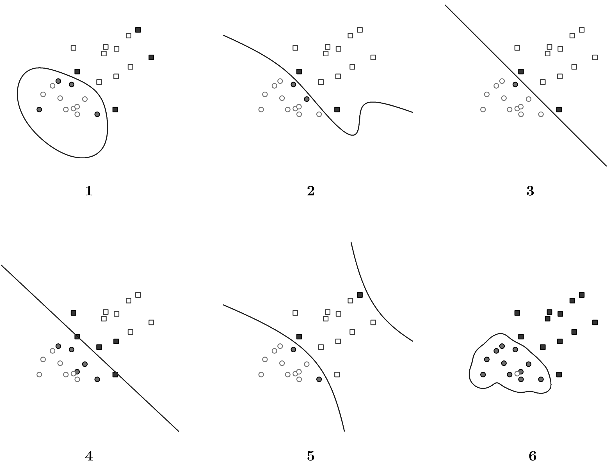

## Problems 1-4: Chapter 6

-   **Exercise #1, #3, #4, #10** from Chapter **6**

## Problems 5-6: Chapter 7

-   **Exercise #3, #6** from Chapter **7**

## Problem 7: Chapter 9 (SVM)

### E.1 Soft-margin SVM

In real world applications, there are outliers in data. This can be dealt with using a soft margin, specified in a slightly different optimization problem as below (soft-margin SVM):

$$
\min \; \frac{1}{2}\, \mathbf{w}\cdot\mathbf{w} \;+\; C\sum_{i=1}^{N}\xi_i
\quad \text{where } \xi_i \ge 0
$$

subject to $$
y^{(i)}\big(\mathbf{w}^T \mathbf{x}^{(i)} + b\big) \ge 1 - \xi_i.
$$

$\xi_i$ represents the slack for each data point $i$, which allows misclassification of datapoints in the event that the data is not linearly seperable. SVM without the addition of slack terms is known as hard-margin SVM.

1.  Intuitively, where does a data point lie relative to where the margin is when $\xi_i = 0$? Is this data point classified correctly?
2.  Intuitively, where does a data point lie relative to where the margin is when $0 < \xi_i \le 1$? Is this data point classified correctly?
3.  Intuitively, where does a data point lie relative to where the margin is when $\xi_i > 1$? Is this data point classified correctly?

### E.2 Kernel SVM

Support Vector Machines can be used to perform non-linear classification with a kernel trick. Recall the hard-margin SVM from class:

$$
\min \; \frac{1}{2}\, \mathbf{w}\cdot\mathbf{w}
\quad \text{s.t. } \;
y^{(i)}\big(\mathbf{w}^T \mathbf{x}^{(i)} + b\big) \ge 1.
$$

The dual of this primal problem can be specified as a procedure to learn the following linear classifier:

$$
f(\mathbf{x}) = \sum_{i=1}^{N} \alpha_i y_i \big(\mathbf{x}_i^T \mathbf{x}\big) + b.
$$

Note that now we can replace $\mathbf{x}_i^T \mathbf{x}$ with a kernel $k(\mathbf{x}_i,\mathbf{x})$, and have a non-linear decision boundary.

In Figure 1, there are different SVMs with different shapes/patterns of decision boundaries. The training data is labeled as $y_i \in \{-1, 1\}$, represented as the shape of circles and squares respectively. Support vectors are drawn in solid circles.

Match the scenarios described below to one of the 6 plots (note that one of the plots does not match to anything). Each scenario should be matched to a unique plot. Explain in less than two sentences why it is the case for each scenario.

1.  A hard-margin linear
2.  A soft-margin linear
3.  A hard-margin kernel SVM with $k(u,v) = u\cdot v + (u\cdot v)^2$
4.  A hard-margin kernel SVM with $k(u,v) = \exp\!\left(-5\|u-v\|^2\right)$
5.  A hard-margin kernel SVM with $k(u,v) = \exp\!\left(-\frac{1}{5}\|u-v\|^2\right)$
