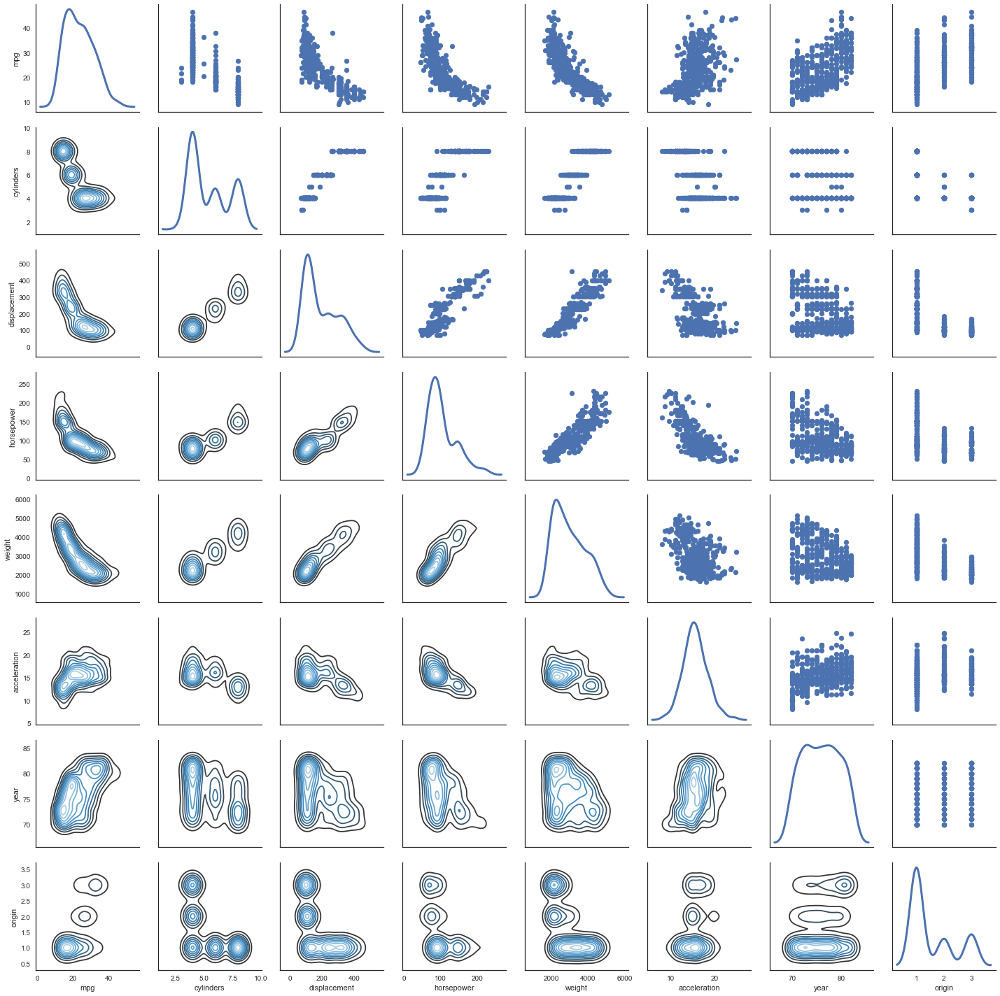
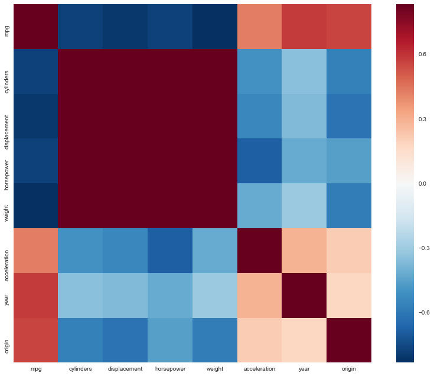
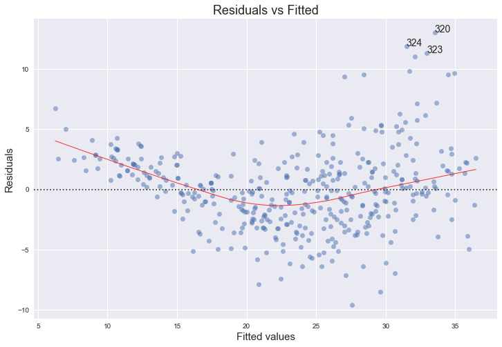
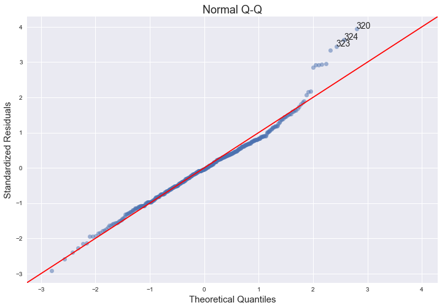
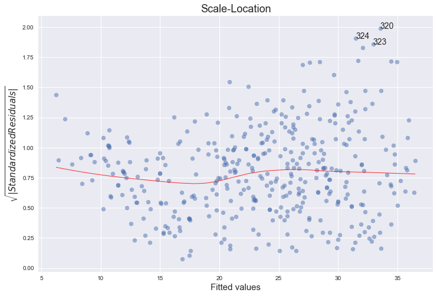
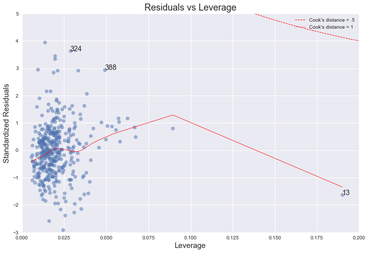
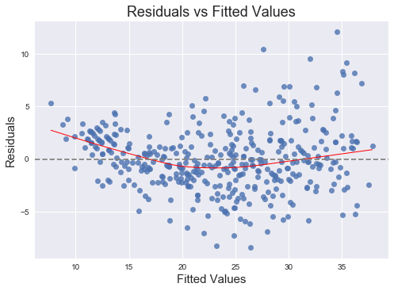

# Exercise 3.9

``` python
%matplotlib inline

import pandas as pd
import numpy as np
import seaborn as sns
import matplotlib.pyplot as plt
import statsmodels.formula.api as smf
import statsmodels.api as sm

sns.set(style="white")
plt.style.use('seaborn-white')
```

``` python
df = pd.read_csv('../data/Auto.csv')
df = pd.read_csv('../data/Auto.csv', na_values='?').dropna()
df.head()
```

<div>

```{=html}
<style>
    .dataframe thead tr:only-child th {
        text-align: right;
    }

    .dataframe thead th {
        text-align: left;
    }

    .dataframe tbody tr th {
        vertical-align: top;
    }
</style>
```

<table>
<thead>
<tr>
<th><p></p></th>
<th><p>mpg</p></th>
<th><p>cylinders</p></th>
<th><p>displacement</p></th>
<th><p>horsepower</p></th>
<th><p>weight</p></th>
<th><p>acceleration</p></th>
<th><p>year</p></th>
<th><p>origin</p></th>
<th><p>name</p></th>
</tr>
</thead>
<tbody>
<tr>
<td><p>0</p></td>
<td><p>18.0</p></td>
<td><p>8</p></td>
<td><p>307.0</p></td>
<td><p>130.0</p></td>
<td><p>3504</p></td>
<td><p>12.0</p></td>
<td><p>70</p></td>
<td><p>1</p></td>
<td><p>chevrolet chevelle malibu</p></td>
</tr>
<tr>
<td><p>1</p></td>
<td><p>15.0</p></td>
<td><p>8</p></td>
<td><p>350.0</p></td>
<td><p>165.0</p></td>
<td><p>3693</p></td>
<td><p>11.5</p></td>
<td><p>70</p></td>
<td><p>1</p></td>
<td><p>buick skylark 320</p></td>
</tr>
<tr>
<td><p>2</p></td>
<td><p>18.0</p></td>
<td><p>8</p></td>
<td><p>318.0</p></td>
<td><p>150.0</p></td>
<td><p>3436</p></td>
<td><p>11.0</p></td>
<td><p>70</p></td>
<td><p>1</p></td>
<td><p>plymouth satellite</p></td>
</tr>
<tr>
<td><p>3</p></td>
<td><p>16.0</p></td>
<td><p>8</p></td>
<td><p>304.0</p></td>
<td><p>150.0</p></td>
<td><p>3433</p></td>
<td><p>12.0</p></td>
<td><p>70</p></td>
<td><p>1</p></td>
<td><p>amc rebel sst</p></td>
</tr>
<tr>
<td><p>4</p></td>
<td><p>17.0</p></td>
<td><p>8</p></td>
<td><p>302.0</p></td>
<td><p>140.0</p></td>
<td><p>3449</p></td>
<td><p>10.5</p></td>
<td><p>70</p></td>
<td><p>1</p></td>
<td><p>ford torino</p></td>
</tr>
</tbody>
</table>

</div>

## (a)

``` python
# http://seaborn.pydata.org/generated/seaborn.PairGrid.html

g = sns.PairGrid(df, diag_sharey=False)
g.map_lower(sns.kdeplot, cmap="Blues_d")
g.map_upper(plt.scatter)
g.map_diag(sns.kdeplot, lw=3, legend=False);
```



## (b)

``` python
# pandas' corr() function takes care of excluding non numeric data: 
# https://github.com/pandas-dev/pandas/blob/v0.19.2/pandas/core/frame.py#L4721
    
df.corr()
```

<div>

```{=html}
<style>
    .dataframe thead tr:only-child th {
        text-align: right;
    }

    .dataframe thead th {
        text-align: left;
    }

    .dataframe tbody tr th {
        vertical-align: top;
    }
</style>
```

+--------------+-----------+-----------+--------------+------------+-----------+--------------+-----------+-----------+
|              | mpg       | cylinders | displacement | horsepower | weight    | acceleration | year      | origin    |
+==============+===========+===========+==============+============+===========+==============+===========+===========+
| mpg          | 1.000000  | -0.777618 | -0.805127    | -0.778427  | -0.832244 | 0.423329     | 0.580541  | 0.565209  |
+--------------+-----------+-----------+--------------+------------+-----------+--------------+-----------+-----------+
| cylinders    | -0.777618 | 1.000000  | 0.950823     | 0.842983   | 0.897527  | -0.504683    | -0.345647 | -0.568932 |
+--------------+-----------+-----------+--------------+------------+-----------+--------------+-----------+-----------+
| displacement | -0.805127 | 0.950823  | 1.000000     | 0.897257   | 0.932994  | -0.543800    | -0.369855 | -0.614535 |
+--------------+-----------+-----------+--------------+------------+-----------+--------------+-----------+-----------+
| horsepower   | -0.778427 | 0.842983  | 0.897257     | 1.000000   | 0.864538  | -0.689196    | -0.416361 | -0.455171 |
+--------------+-----------+-----------+--------------+------------+-----------+--------------+-----------+-----------+
| weight       | -0.832244 | 0.897527  | 0.932994     | 0.864538   | 1.000000  | -0.416839    | -0.309120 | -0.585005 |
+--------------+-----------+-----------+--------------+------------+-----------+--------------+-----------+-----------+
| acceleration | 0.423329  | -0.504683 | -0.543800    | -0.689196  | -0.416839 | 1.000000     | 0.290316  | 0.212746  |
+--------------+-----------+-----------+--------------+------------+-----------+--------------+-----------+-----------+
| year         | 0.580541  | -0.345647 | -0.369855    | -0.416361  | -0.309120 | 0.290316     | 1.000000  | 0.181528  |
+--------------+-----------+-----------+--------------+------------+-----------+--------------+-----------+-----------+
| origin       | 0.565209  | -0.568932 | -0.614535    | -0.455171  | -0.585005 | 0.212746     | 0.181528  | 1.000000  |
+--------------+-----------+-----------+--------------+------------+-----------+--------------+-----------+-----------+

</div>

**Extra**

Why not a correlation heatmap as well?

<http://seaborn.pydata.org/examples/network_correlations.html>

``` python
corrmat = df.corr()
# Set up the matplotlib figure
f, ax = plt.subplots(figsize=(12, 9))

# Draw the heatmap using seaborn
sns.heatmap(corrmat, vmax=.8, square=True)

f.tight_layout()
```



## (c)

``` python
reg = smf.ols('mpg ~ cylinders + displacement + horsepower + weight + acceleration + year + origin', df).fit()
reg.summary()
```

+-------------------+------------------+---------------------+------------------------+
|                   |                  |                     | OLS Regression Results |
+-------------------+------------------+---------------------+------------------------+
| Dep. Variable:    | mpg              | R-squared:          | 0.821                  |
+-------------------+------------------+---------------------+------------------------+
| Model:            | OLS              | Adj. R-squared:     | 0.818                  |
+-------------------+------------------+---------------------+------------------------+
| Method:           | Least Squares    | F-statistic:        | 252.4                  |
+-------------------+------------------+---------------------+------------------------+
| Date:             | Fri, 08 Dec 2017 | Prob (F-statistic): | 2.04e-139              |
+-------------------+------------------+---------------------+------------------------+
| Time:             | 09:49:08         | Log-Likelihood:     | -1023.5                |
+-------------------+------------------+---------------------+------------------------+
| No. Observations: | 392              | AIC:                | 2063\.                 |
+-------------------+------------------+---------------------+------------------------+
| Df Residuals:     | 384              | BIC:                | 2095\.                 |
+-------------------+------------------+---------------------+------------------------+
| Df Model:         | 7                |                     |                        |
+-------------------+------------------+---------------------+------------------------+
| Covariance Type:  | nonrobust        |                     |                        |
+-------------------+------------------+---------------------+------------------------+

|              |          |         |        |          |         |         |
|--------------|:---------|:--------|:-------|:---------|:--------|:--------|
|              | coef     | std err | t      | P\>\|t\| | \[0.025 | 0.975\] |
| Intercept    | -17.2184 | 4.644   | -3.707 | 0.000    | -26.350 | -8.087  |
| cylinders    | -0.4934  | 0.323   | -1.526 | 0.128    | -1.129  | 0.142   |
| displacement | 0.0199   | 0.008   | 2.647  | 0.008    | 0.005   | 0.035   |
| horsepower   | -0.0170  | 0.014   | -1.230 | 0.220    | -0.044  | 0.010   |
| weight       | -0.0065  | 0.001   | -9.929 | 0.000    | -0.008  | -0.005  |
| acceleration | 0.0806   | 0.099   | 0.815  | 0.415    | -0.114  | 0.275   |
| year         | 0.7508   | 0.051   | 14.729 | 0.000    | 0.651   | 0.851   |
| origin       | 1.4261   | 0.278   | 5.127  | 0.000    | 0.879   | 1.973   |

| Omnibus:       | 31.906 | Durbin-Watson:    | 1.309    |
|:---------------|--------|:------------------|----------|
| Prob(Omnibus): | 0.000  | Jarque-Bera (JB): | 53.100   |
| Skew:          | 0.529  | Prob(JB):         | 2.95e-12 |
| Kurtosis:      | 4.460  | Cond. No.         | 8.59e+04 |

## i

Yes, there is a relationship between the predictors and the response. In the table above we can see that the value of the F-statistic is 252 which is much larger than 1, so we can reject the corresponding null hypothesis:

$$
H_0 :\beta_{cylinders} = \beta_{displacement} = \beta_{weight} = \beta_{acceleration} = \beta_{year} = \beta_{origin}  =0.  
$$

In fact, the probability this data would be generated if $H_0$ was true is $Prob(F-Statistic) = 2 \times 10^{-139}$, a ridiculously low value.

## ii

We can see which predictors have a statistically significant relationship with the response by looking at the p-values in the table above. The predictors that have a statistically significant relationship to the response are definitely weight, year and origin, and we could say displacement as well; while cylinders, horsepower, and acceleration do not.

## iii

The coefficient suggests that, on average, when the other variables are held constant, an increase of one year (of production) corresponds to an increase of 0.75 of mpg (so, the more recent the more efficient).

## (d)

In R \[4\], by default, plot() on a fit produces 4 plots: \* a plot of residuals against fitted values, \* a Scale-Location plot of sqrt(\| residuals \|) against fitted values, \* a Normal Q-Q plot, \* a plot of residuals against leverages.

Below, we plot each of these 4 plots. We use the code published by Emre Can \[5\] with a few adaptations.

``` python
import statsmodels.formula.api as smf
from statsmodels.graphics.gofplots import ProbPlot

plt.style.use('seaborn') # pretty matplotlib plots
plt.rc('font', size=14)
plt.rc('figure', titlesize=18)
plt.rc('axes', labelsize=15)
plt.rc('axes', titlesize=18)

model_f = 'mpg ~ cylinders + \
                 displacement + \
                 horsepower + \
                 weight + \
                 acceleration + \
                 year + \
                 origin'

df.reset_index(drop=True, inplace=True)

model = smf.ols(formula=model_f, data=df)

model_fit = model.fit()

# fitted values (need a constant term for intercept)
model_fitted_y = model_fit.fittedvalues

# model residuals
model_residuals = model_fit.resid

# normalized residuals
model_norm_residuals = model_fit.get_influence().resid_studentized_internal

# absolute squared normalized residuals
model_norm_residuals_abs_sqrt = np.sqrt(np.abs(model_norm_residuals))

# absolute residuals
model_abs_resid = np.abs(model_residuals)

# leverage, from statsmodels internals
model_leverage = model_fit.get_influence().hat_matrix_diag

# cook's distance, from statsmodels internals
model_cooks = model_fit.get_influence().cooks_distance[0]
```

### Residuals against fitted values

``` python
plot_lm_1 = plt.figure(1)
plot_lm_1.set_figheight(8)
plot_lm_1.set_figwidth(12)

plot_lm_1.axes[0] = sns.residplot(model_fitted_y, 'mpg', data=df,
                                  lowess=True,
                                  scatter_kws={'alpha': 0.5},
                                  line_kws={'color': 'red', 'lw': 1, 'alpha': 0.8})

plot_lm_1.axes[0].set_title('Residuals vs Fitted')
plot_lm_1.axes[0].set_xlabel('Fitted values')
plot_lm_1.axes[0].set_ylabel('Residuals')


# annotations
abs_resid = model_abs_resid.sort_values(ascending=False)
abs_resid_top_3 = abs_resid[:3]

for i in abs_resid_top_3.index:
    plot_lm_1.axes[0].annotate(i, 
                               xy=(model_fitted_y[i], 
                                   model_residuals[i]));
```



### Normal Q-Q plot

``` python
QQ = ProbPlot(model_norm_residuals)
plot_lm_2 = QQ.qqplot(line='45', alpha=0.5, color='#4C72B0', lw=1)

plot_lm_2.set_figheight(8)
plot_lm_2.set_figwidth(12)

plot_lm_2.axes[0].set_title('Normal Q-Q')
plot_lm_2.axes[0].set_xlabel('Theoretical Quantiles')
plot_lm_2.axes[0].set_ylabel('Standardized Residuals');

# annotations
abs_norm_resid = np.flip(np.argsort(np.abs(model_norm_residuals)), 0)
abs_norm_resid_top_3 = abs_norm_resid[:3]

for r, i in enumerate(abs_norm_resid_top_3):
    plot_lm_2.axes[0].annotate(i, 
                               xy=(np.flip(QQ.theoretical_quantiles, 0)[r],
                                   model_norm_residuals[i]));
```



### Scale-Location plot of sqrt(\|residuals\|) against fitted values

``` python
plot_lm_3 = plt.figure(3)
plot_lm_3.set_figheight(8)
plot_lm_3.set_figwidth(12)

plt.scatter(model_fitted_y, model_norm_residuals_abs_sqrt, alpha=0.5)
sns.regplot(model_fitted_y, model_norm_residuals_abs_sqrt, 
            scatter=False, 
            ci=False, 
            lowess=True,
            line_kws={'color': 'red', 'lw': 1, 'alpha': 0.8})

plot_lm_3.axes[0].set_title('Scale-Location')
plot_lm_3.axes[0].set_xlabel('Fitted values')
plot_lm_3.axes[0].set_ylabel('$\sqrt{|Standardized Residuals|}$');


for i in abs_norm_resid_top_3:
    plot_lm_3.axes[0].annotate(i, 
                               xy=(model_fitted_y[i], 
                                   model_norm_residuals_abs_sqrt[i]));
```



### Residuals against leverages

``` python
plot_lm_4 = plt.figure(4)
plot_lm_4.set_figheight(8)
plot_lm_4.set_figwidth(12)

plt.scatter(model_leverage, model_norm_residuals, alpha=0.5)
sns.regplot(model_leverage, model_norm_residuals, 
            scatter=False, 
            ci=False, 
            lowess=True,
            line_kws={'color': 'red', 'lw': 1, 'alpha': 0.8})

plot_lm_4.axes[0].set_xlim(0, 0.20)
plot_lm_4.axes[0].set_ylim(-3, 5)
plot_lm_4.axes[0].set_title('Residuals vs Leverage')
plot_lm_4.axes[0].set_xlabel('Leverage')
plot_lm_4.axes[0].set_ylabel('Standardized Residuals')

# annotations
leverage_top_3 = np.flip(np.argsort(model_cooks), 0)[:3]

for i in leverage_top_3:
    plot_lm_4.axes[0].annotate(i, 
                               xy=(model_leverage[i], 
                                   model_norm_residuals[i]))
    
# shenanigans for cook's distance contours
def graph(formula, x_range, label=None, ls='-'):
    x = x_range
    y = formula(x)
    plt.plot(x, y, label=label, lw=1, ls=ls, color='red')

p = len(model_fit.params) # number of model parameters

graph(lambda x: np.sqrt((0.5 * p * (1 - x)) / x), 
      np.linspace(0.001, 0.200, 50), 
      'Cook\'s distance = .5', ls='--') # 0.5 line

graph(lambda x: np.sqrt((1 * p * (1 - x)) / x), 
      np.linspace(0.001, 0.200, 50), 'Cook\'s distance = 1', ls=':') # 1 line

plt.legend(loc='upper right');
```



## Comments

No, there are no unusually large outliers, as per the the scale log location. They are however skewedly distributed. The larger the fitted value, the larger the variance, since the spread of the residuals increases.

No, even though there is an observation (number 13) with higher leverage, it is still well within Cook's 0.5 distance.

The normal qq-plot deviates at one extreme, which could indicate that there are other explanatory predictors that we are not considering (quadratic terms, for example). Additionally, the funnel shape of the residuals plot indicates heteroskedacity.

## References

\[1\] https://stat.ethz.ch/R-manual/R-devel/library/stats/html/plot.lm.html

\[2\] https://emredjan.github.io/blog/2017/07/11/emulating-r-plots-in-python/

## (e)

Statsmodels uses patsy which is a "mini-language" inspired by R and S to describe statistical models. The symbols ':' and '\*' have the same meaning as in R. Namely, a:b includes an interaction term between a and b, while a\*b is shorthand for a + b + a:b, that is, it includes a and b as well.

References:

-   http://patsy.readthedocs.io/en/latest/formulas.html
-   http://stackoverflow.com/questions/33050104/difference-between-the-interaction-and-term-for-formulas-in-statsmodels-ols
-   http://stackoverflow.com/questions/23672466/interaction-effects-in-patsy-with-patsy-dmatrices-giving-duplicate-columns-for

So, which pairs of variables would we expect to interact, both a priori (from our interpretation of the meaning of these variables) and from the pairs plot?

Perhaps horsepower and year? What would this mean? It would mean that, for different years, varying horsepower has different effect on mpg. It seems plausible. We could also interpret it in the reverse order: for different values of horsepower, does varying year have a different effect on mpg? For example, does the change in mpg when varying year (i.e., the derivative dmpg/dyear), differ when holding horsepower at either 130 or 160?

Let's find out.

``` python
reg = smf.ols('mpg ~ horsepower*year + displacement + weight + origin', df).fit()
reg.summary()
```

+-------------------+------------------+---------------------+------------------------+
|                   |                  |                     | OLS Regression Results |
+-------------------+------------------+---------------------+------------------------+
| Dep. Variable:    | mpg              | R-squared:          | 0.851                  |
+-------------------+------------------+---------------------+------------------------+
| Model:            | OLS              | Adj. R-squared:     | 0.849                  |
+-------------------+------------------+---------------------+------------------------+
| Method:           | Least Squares    | F-statistic:        | 367.0                  |
+-------------------+------------------+---------------------+------------------------+
| Date:             | Fri, 08 Dec 2017 | Prob (F-statistic): | 7.51e-156              |
+-------------------+------------------+---------------------+------------------------+
| Time:             | 09:49:11         | Log-Likelihood:     | -987.81                |
+-------------------+------------------+---------------------+------------------------+
| No. Observations: | 392              | AIC:                | 1990\.                 |
+-------------------+------------------+---------------------+------------------------+
| Df Residuals:     | 385              | BIC:                | 2017\.                 |
+-------------------+------------------+---------------------+------------------------+
| Df Model:         | 6                |                     |                        |
+-------------------+------------------+---------------------+------------------------+
| Covariance Type:  | nonrobust        |                     |                        |
+-------------------+------------------+---------------------+------------------------+

|                 |          |         |         |          |          |         |
|-----------------|:---------|:--------|:--------|:---------|:---------|:--------|
|                 | coef     | std err | t       | P\>\|t\| | \[0.025  | 0.975\] |
| Intercept       | -96.6688 | 9.667   | -10.000 | 0.000    | -115.675 | -77.663 |
| horsepower      | 0.7993   | 0.092   | 8.687   | 0.000    | 0.618    | 0.980   |
| year            | 1.8179   | 0.128   | 14.221  | 0.000    | 1.567    | 2.069   |
| horsepower:year | -0.0113  | 0.001   | -8.977  | 0.000    | -0.014   | -0.009  |
| displacement    | 0.0068   | 0.005   | 1.344   | 0.180    | -0.003   | 0.017   |
| weight          | -0.0054  | 0.001   | -10.170 | 0.000    | -0.006   | -0.004  |
| origin          | 1.1866   | 0.253   | 4.684   | 0.000    | 0.688    | 1.685   |

| Omnibus:       | 21.932 | Durbin-Watson:    | 1.488    |
|:---------------|--------|:------------------|----------|
| Prob(Omnibus): | 0.000  | Jarque-Bera (JB): | 33.066   |
| Skew:          | 0.411  | Prob(JB):         | 6.60e-08 |
| Kurtosis:      | 4.161  | Cond. No.         | 5.60e+05 |

From the value of the p-value of the coefficient of the interaction term between horsepower and year, it does seem like there is a statistically significant relationship between the response and horsepower:year.

With 7 factors, there will be a total of 21 interaction terms. For simplicity sake, we will exclude all the terms with cylinders and acceleration, leaving us with 10 interaction terms. Let's try to fit a model with these terms - a total of 15 terms.

``` python
model = 'mpg ~ displacement + horsepower + origin + weight + year \
               + displacement:horsepower + displacement:origin + displacement:weight + displacement:year \
               + horsepower:origin + horsepower:weight + horsepower:year + origin:weight + origin:year + weight:year'
reg = smf.ols(model, df).fit()
reg.summary()
```

+-------------------+------------------+---------------------+------------------------+
|                   |                  |                     | OLS Regression Results |
+-------------------+------------------+---------------------+------------------------+
| Dep. Variable:    | mpg              | R-squared:          | 0.880                  |
+-------------------+------------------+---------------------+------------------------+
| Model:            | OLS              | Adj. R-squared:     | 0.875                  |
+-------------------+------------------+---------------------+------------------------+
| Method:           | Least Squares    | F-statistic:        | 184.0                  |
+-------------------+------------------+---------------------+------------------------+
| Date:             | Fri, 08 Dec 2017 | Prob (F-statistic): | 1.09e-162              |
+-------------------+------------------+---------------------+------------------------+
| Time:             | 09:49:11         | Log-Likelihood:     | -945.49                |
+-------------------+------------------+---------------------+------------------------+
| No. Observations: | 392              | AIC:                | 1923\.                 |
+-------------------+------------------+---------------------+------------------------+
| Df Residuals:     | 376              | BIC:                | 1987\.                 |
+-------------------+------------------+---------------------+------------------------+
| Df Model:         | 15               |                     |                        |
+-------------------+------------------+---------------------+------------------------+
| Covariance Type:  | nonrobust        |                     |                        |
+-------------------+------------------+---------------------+------------------------+

|                         |            |          |        |          |           |          |
|-------------------------|:-----------|:---------|:-------|:---------|:----------|:---------|
|                         | coef       | std err  | t      | P\>\|t\| | \[0.025   | 0.975\]  |
| Intercept               | -51.3746   | 26.175   | -1.963 | 0.050    | -102.843  | 0.093    |
| displacement            | -0.1818    | 0.120    | -1.521 | 0.129    | -0.417    | 0.053    |
| horsepower              | 0.9485     | 0.232    | 4.089  | 0.000    | 0.492     | 1.405    |
| origin                  | -3.0637    | 5.496    | -0.557 | 0.578    | -13.871   | 7.744    |
| weight                  | -0.0174    | 0.016    | -1.115 | 0.265    | -0.048    | 0.013    |
| year                    | 1.3975     | 0.328    | 4.267  | 0.000    | 0.754     | 2.042    |
| displacement:horsepower | -0.0001    | 0.000    | -0.815 | 0.416    | -0.000    | 0.000    |
| displacement:origin     | 0.0282     | 0.013    | 2.172  | 0.030    | 0.003     | 0.054    |
| displacement:weight     | 2.792e-05  | 5.99e-06 | 4.663  | 0.000    | 1.61e-05  | 3.97e-05 |
| displacement:year       | 0.0010     | 0.001    | 0.710  | 0.478    | -0.002    | 0.004    |
| horsepower:origin       | -0.0629    | 0.020    | -3.104 | 0.002    | -0.103    | -0.023   |
| horsepower:weight       | -1.175e-05 | 1.77e-05 | -0.664 | 0.507    | -4.65e-05 | 2.3e-05  |
| horsepower:year         | -0.0114    | 0.003    | -3.998 | 0.000    | -0.017    | -0.006   |
| origin:weight           | 0.0014     | 0.001    | 1.200  | 0.231    | -0.001    | 0.004    |
| origin:year             | 0.0322     | 0.069    | 0.464  | 0.643    | -0.104    | 0.169    |
| weight:year             | 7.438e-05  | 0.000    | 0.394  | 0.694    | -0.000    | 0.000    |

| Omnibus:       | 52.658 | Durbin-Watson:    | 1.599    |
|:---------------|--------|:------------------|----------|
| Prob(Omnibus): | 0.000  | Jarque-Bera (JB): | 115.208  |
| Skew:          | 0.710  | Prob(JB):         | 9.61e-26 |
| Kurtosis:      | 5.244  | Cond. No.         | 1.81e+08 |

These results indicate that the interactions that appear to be statistically significant are displacement:weight, horsepower:origin and horsepower:year. Interestingly, when these are considered the only first order terms that are statistically different are horsepower and year. By the hierarchy principle (page 89), we should nonetheless include all of the main effects (for more on this, see [these](https://stats.stackexchange.com/questions/27724/do-all-interactions-terms-need-their-individual-terms-in-regression-model) answers).

We could also have a try at [interaction plots](https://en.wikipedia.org/wiki/Interaction_%28statistics%29#Interaction_plots), which are not covered in the book, but we will leave it as a [mention](https://en.wikipedia.org/wiki/Interaction_%28statistics%29#/media/File:GSS_sealevel_interaction.png) only.

## (f)

As an example, we fit the data with a model containing the transformations indicated for the variable horsepower, starting with $X^2$.

``` python
reg = smf.ols('mpg ~ horsepower + np.power(horsepower,2) + weight + year + origin', df).fit()
reg.summary()
```

+-------------------+------------------+---------------------+------------------------+
|                   |                  |                     | OLS Regression Results |
+-------------------+------------------+---------------------+------------------------+
| Dep. Variable:    | mpg              | R-squared:          | 0.851                  |
+-------------------+------------------+---------------------+------------------------+
| Model:            | OLS              | Adj. R-squared:     | 0.849                  |
+-------------------+------------------+---------------------+------------------------+
| Method:           | Least Squares    | F-statistic:        | 439.5                  |
+-------------------+------------------+---------------------+------------------------+
| Date:             | Fri, 08 Dec 2017 | Prob (F-statistic): | 7.11e-157              |
+-------------------+------------------+---------------------+------------------------+
| Time:             | 09:49:11         | Log-Likelihood:     | -988.57                |
+-------------------+------------------+---------------------+------------------------+
| No. Observations: | 392              | AIC:                | 1989\.                 |
+-------------------+------------------+---------------------+------------------------+
| Df Residuals:     | 386              | BIC:                | 2013\.                 |
+-------------------+------------------+---------------------+------------------------+
| Df Model:         | 5                |                     |                        |
+-------------------+------------------+---------------------+------------------------+
| Covariance Type:  | nonrobust        |                     |                        |
+-------------------+------------------+---------------------+------------------------+

|                         |         |          |         |          |         |         |
|-------------------------|:--------|:---------|:--------|:---------|:--------|:--------|
|                         | coef    | std err  | t       | P\>\|t\| | \[0.025 | 0.975\] |
| Intercept               | -6.6457 | 3.915    | -1.698  | 0.090    | -14.343 | 1.052   |
| horsepower              | -0.2441 | 0.027    | -9.099  | 0.000    | -0.297  | -0.191  |
| np.power(horsepower, 2) | 0.0008  | 9.13e-05 | 9.170   | 0.000    | 0.001   | 0.001   |
| weight                  | -0.0044 | 0.000    | -10.426 | 0.000    | -0.005  | -0.004  |
| year                    | 0.7456  | 0.046    | 16.145  | 0.000    | 0.655   | 0.836   |
| origin                  | 1.0465  | 0.238    | 4.405   | 0.000    | 0.579   | 1.514   |

| Omnibus:       | 21.819 | Durbin-Watson:    | 1.500    |
|:---------------|--------|:------------------|----------|
| Prob(Omnibus): | 0.000  | Jarque-Bera (JB): | 32.447   |
| Skew:          | 0.414  | Prob(JB):         | 9.00e-08 |
| Kurtosis:      | 4.140  | Cond. No.         | 4.10e+05 |

``` python
fig = plt.figure()
fitted = reg.fittedvalues
sns.regplot(fitted, df.mpg - fitted,  lowess=True, line_kws={'color':'r', 'lw':1})
ax = fig.axes[0]
ax.axhline(color="grey", ls="--")
ax.set_title("Residuals vs Fitted Values")
ax.set_xlabel("Fitted Values")
ax.set_ylabel("Residuals");
```



It is clear that this quadratic term is statistically significant. Let's try adding a logarithmic term as well.

``` python
reg = smf.ols('mpg ~ horsepower + np.power(horsepower,2) + np.log(horsepower) + weight + year + origin', df).fit()
reg.summary()
```

+-------------------+------------------+---------------------+------------------------+
|                   |                  |                     | OLS Regression Results |
+-------------------+------------------+---------------------+------------------------+
| Dep. Variable:    | mpg              | R-squared:          | 0.855                  |
+-------------------+------------------+---------------------+------------------------+
| Model:            | OLS              | Adj. R-squared:     | 0.853                  |
+-------------------+------------------+---------------------+------------------------+
| Method:           | Least Squares    | F-statistic:        | 378.6                  |
+-------------------+------------------+---------------------+------------------------+
| Date:             | Fri, 08 Dec 2017 | Prob (F-statistic): | 4.62e-158              |
+-------------------+------------------+---------------------+------------------------+
| Time:             | 09:49:11         | Log-Likelihood:     | -982.62                |
+-------------------+------------------+---------------------+------------------------+
| No. Observations: | 392              | AIC:                | 1979\.                 |
+-------------------+------------------+---------------------+------------------------+
| Df Residuals:     | 385              | BIC:                | 2007\.                 |
+-------------------+------------------+---------------------+------------------------+
| Df Model:         | 6                |                     |                        |
+-------------------+------------------+---------------------+------------------------+
| Covariance Type:  | nonrobust        |                     |                        |
+-------------------+------------------+---------------------+------------------------+

|                         |          |         |         |          |         |         |
|-------------------------|:---------|:--------|:--------|:---------|:--------|:--------|
|                         | coef     | std err | t       | P\>\|t\| | \[0.025 | 0.975\] |
| Intercept               | 80.3681  | 25.568  | 3.143   | 0.002    | 30.098  | 130.638 |
| horsepower              | 0.2570   | 0.148   | 1.737   | 0.083    | -0.034  | 0.548   |
| np.power(horsepower, 2) | -0.0002  | 0.000   | -0.571  | 0.568    | -0.001  | 0.000   |
| np.log(horsepower)      | -27.5412 | 8.000   | -3.443  | 0.001    | -43.270 | -11.812 |
| weight                  | -0.0048  | 0.000   | -11.098 | 0.000    | -0.006  | -0.004  |
| year                    | 0.7561   | 0.046   | 16.565  | 0.000    | 0.666   | 0.846   |
| origin                  | 0.9480   | 0.236   | 4.016   | 0.000    | 0.484   | 1.412   |

| Omnibus:       | 17.905 | Durbin-Watson:    | 1.575    |
|:---------------|--------|:------------------|----------|
| Prob(Omnibus): | 0.000  | Jarque-Bera (JB): | 29.299   |
| Skew:          | 0.312  | Prob(JB):         | 4.34e-07 |
| Kurtosis:      | 4.185  | Cond. No.         | 2.84e+06 |

Now the p-value for the square term is very large. This indicates that there is indeed a non-linearity but it seems to be better captured by the logarithm than the square. Let's try adding the square root term.

``` python
reg = smf.ols('mpg ~ horsepower + np.power(horsepower,2) + np.log(horsepower) + np.sqrt(horsepower) + weight + year + origin', df).fit()
reg.summary()
```

+-------------------+------------------+---------------------+------------------------+
|                   |                  |                     | OLS Regression Results |
+-------------------+------------------+---------------------+------------------------+
| Dep. Variable:    | mpg              | R-squared:          | 0.859                  |
+-------------------+------------------+---------------------+------------------------+
| Model:            | OLS              | Adj. R-squared:     | 0.856                  |
+-------------------+------------------+---------------------+------------------------+
| Method:           | Least Squares    | F-statistic:        | 332.9                  |
+-------------------+------------------+---------------------+------------------------+
| Date:             | Fri, 08 Dec 2017 | Prob (F-statistic): | 9.16e-159              |
+-------------------+------------------+---------------------+------------------------+
| Time:             | 09:49:12         | Log-Likelihood:     | -977.89                |
+-------------------+------------------+---------------------+------------------------+
| No. Observations: | 392              | AIC:                | 1972\.                 |
+-------------------+------------------+---------------------+------------------------+
| Df Residuals:     | 384              | BIC:                | 2004\.                 |
+-------------------+------------------+---------------------+------------------------+
| Df Model:         | 7                |                     |                        |
+-------------------+------------------+---------------------+------------------------+
| Covariance Type:  | nonrobust        |                     |                        |
+-------------------+------------------+---------------------+------------------------+

|                         |           |         |         |          |          |         |
|-------------------------|:----------|:--------|:--------|:---------|:---------|:--------|
|                         | coef      | std err | t       | P\>\|t\| | \[0.025  | 0.975\] |
| Intercept               | -426.3991 | 167.288 | -2.549  | 0.011    | -755.314 | -97.485 |
| horsepower              | 8.4452    | 2.676   | 3.156   | 0.002    | 3.184    | 13.706  |
| np.power(horsepower, 2) | -0.0060   | 0.002   | -3.117  | 0.002    | -0.010   | -0.002  |
| np.log(horsepower)      | 416.0064  | 144.951 | 2.870   | 0.004    | 131.009  | 701.004 |
| np.sqrt(horsepower)     | -229.6161 | 74.927  | -3.065  | 0.002    | -376.934 | -82.298 |
| weight                  | -0.0048   | 0.000   | -11.229 | 0.000    | -0.006   | -0.004  |
| year                    | 0.7475    | 0.045   | 16.522  | 0.000    | 0.659    | 0.836   |
| origin                  | 0.9088    | 0.234   | 3.886   | 0.000    | 0.449    | 1.369   |

| Omnibus:       | 23.395 | Durbin-Watson:    | 1.570    |
|:---------------|--------|:------------------|----------|
| Prob(Omnibus): | 0.000  | Jarque-Bera (JB): | 37.804   |
| Skew:          | 0.411  | Prob(JB):         | 6.18e-09 |
| Kurtosis:      | 4.281  | Cond. No.         | 2.50e+07 |

So now the square term is back to a small p-value, indicating that it is statistically significant in the presence of the square root and the logarithm.
