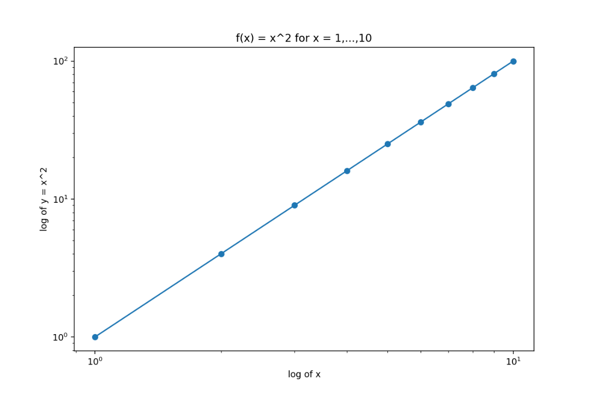
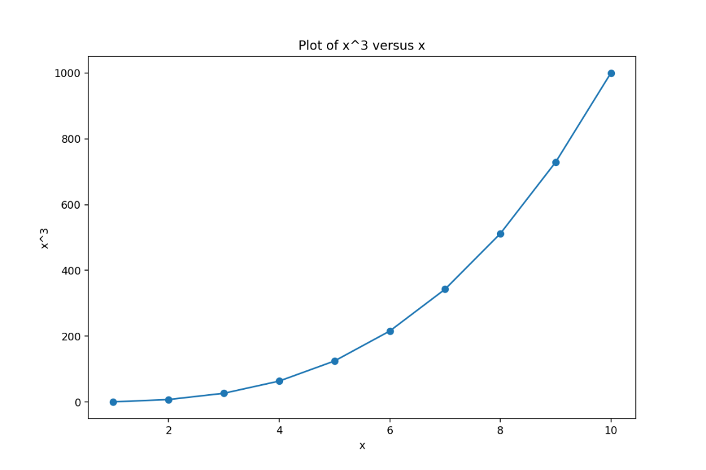

# Exercise 4.15

``` python
import numpy as np
import matplotlib.pyplot as plt
```

## (a) `Power()` prints (2\^3)

``` python
def Power():
    # compute 2^3 and print it
    print(2**3)

Power()
```

Expected output:

```         
8
```

## (b) `Power2(x, a)` prints (x\^a)

``` python
def Power2(x, a):
    print(x**a)

Power2(3, 8)
```

Expected output:

```         
6561
```

## (c) Use `Power2()` to compute (10\^3), (8\^{17}), and (131\^3)

``` python
Power2(10, 3)
Power2(8, 17)
Power2(131, 3)
```

Expected output:

```         
1000
2251799813685248
2248091
```

## (d) `Power3(x, a)` returns (x\^a) (instead of printing)

``` python
def Power3(x, a):
    result = x**a
    return result

Power3(3, 8)
```

Expected output:

```         
6561
```

## (e) Using `Power3()`, plot (f(x)=x\^2) for integers 1 to 10

``` python
x = np.arange(1, 11)
y = np.array([Power3(xi, 2) for xi in x])

fig, ax = plt.subplots()
ax.plot(x, y, marker="o")
ax.set_xscale("log")
ax.set_yscale("log")
ax.set_xlabel("Log of x")
ax.set_ylabel("Log of y = x^2")
ax.set_title("f(x) = x^2 for x = 1,...,10")

plt.show()
```



## (f) `PlotPower(x, a)` plots (x) against (x\^a) for a fixed (a)

``` python
def PlotPower(x, a):
    x = np.asarray(x)
    y = Power3(x, a)  # vectorized, since ** works elementwise on numpy arrays

    fig, ax = plt.subplots()
    ax.plot(x, y, marker="o")
    ax.set_xlabel("x")
    ax.set_ylabel(f"x^{a}")
    ax.set_title(f"Plot of x^{a} versus x")
    plt.show()

PlotPower(np.arange(1, 11), 3)
```


